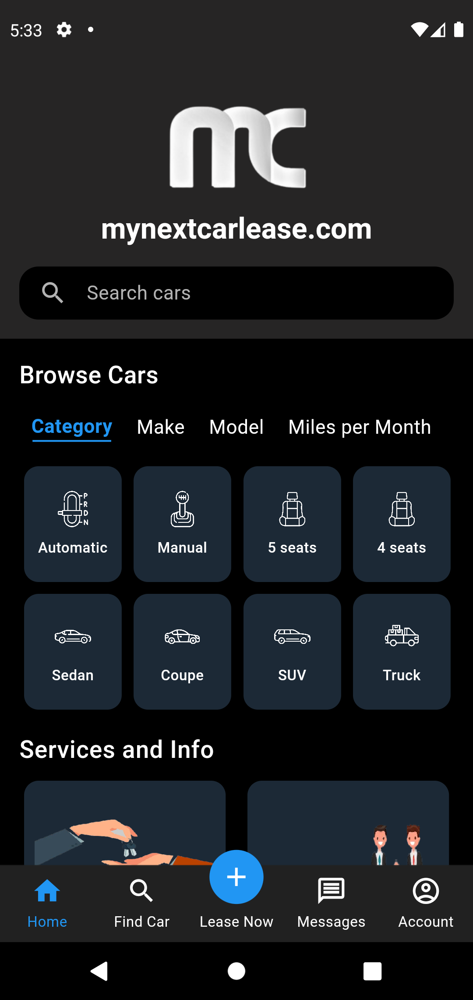

  

# MyNextCarLease (Flutter Mobile App)

A feature-rich car leasing mobile application built using **Flutter**, designed to connect car sellers and buyers with a modern, user-friendly interface. The app allows sellers to list vehicles while buyers can **filter and browse cars using 8–9 search criteria** such as price, model, mileage, transmission, fuel type, and more.

The mobile app includes:

- 🔍 Advanced search and filter system  
- 💬 **In-app chat** between buyers and sellers  
- 🖼️ **AI-based image detection** (only shows valid car images)  
- 📞 Integrated support contact and issue reporting  
- 👁️ Vehicle detail view tracking (who viewed which car)  
- 📱 Optimized UI/UX for Android & iOS devices  

The backend is powered by **Node.js**, while images are stored on **AWS S3** and deployed via **AWS EC2**. The mobile app is built separately from the web (Next.js + TypeScript).

---

### 📸 Screenshots

#### 🏠 Home Page + 🔍 Search Page  
Browse available car listings and filter them with multiple criteria.

  
  
  

---

#### 📄 Find Car & Detail Pages  

  
  
  

---

#### 🧑 Car owner Dashboard, 👤 Profile Page  
Manage listings, view personalized suggestions, and update user settings.

   
  
  

---

### 🚀 Key Highlights

- Fully separate mobile Flutter application
- Advanced filtering and car search features
- In-app chat and messaging
- Real-time support and listing management
- Vehicle view tracking system
- AWS S3 for image handling and EC2 for deployment

---

